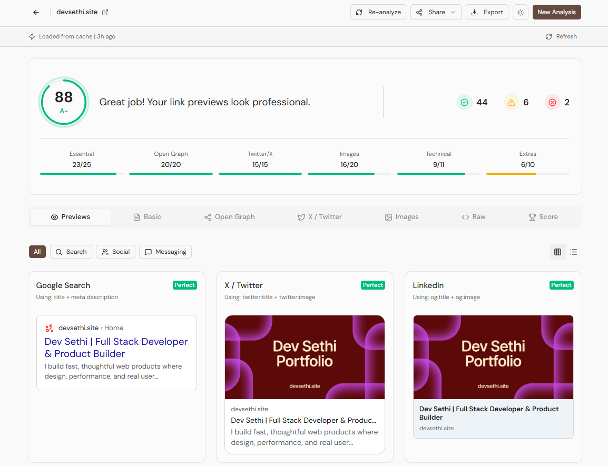

<div align="center">
  
  
  # Metaview
  
  Your link previews are broken. Find out why in seconds

[](https://metaview.devsethi.site)
[](https://github.com/devsethi3/metaview)
<br />

<!-- [Features](#-core-features) • [Quick Start](#-getting-started) • [Tech Stack](#-tech-stack) • [Contributing](#-contributing) • [License](#-license) -->



---

</div>

## Overview

**Metaview** is an open-source developer tool designed to debug, analyze, and optimize Open Graph (OG) tags and Twitter Cards.

In the modern web, a link is often the first interaction a user has with your product. If your link preview on Slack, Discord, or X (Twitter) looks broken, you lose trust instantly. Metaview goes beyond simple validators by providing a **comprehensive scoring system**, **multi-platform previews**, and **copy-paste code fixes** for modern frameworks.

Built with performance in mind using Next.js 16 and Cheerio, it runs analysis locally or via edge functions to return results in milliseconds.

## Key Features

### Deep Analysis & Scoring

- **35+ Quality Checks:** We validate essential meta tags, Open Graph protocols, Twitter Cards, and technical SEO requirements.
- **Smart Scoring:** Algorithms grade your metadata from **A to F** based on completeness, image aspect ratios, and tag redundancy.
- **Image Intelligence:** Automatically analyzes OG image dimensions, file size, and load time to ensure they render correctly on all devices.

### 9+ Platform Previews

See exactly how your link renders before you ship. Metaview emulates the parsing logic of:

- Google Search
- X (Twitter)
- LinkedIn
- Discord & Slack
- WhatsApp, Telegram & iMessage
- Facebook

### Developer-First Tooling

- **Framework-Specific Fixes:** Don't just see the error—fix it. Get ready-to-use code snippets for **Next.js**, **Astro**, **Hugo**, and plain **HTML**.
- **Raw Data Export:** Download parsed metadata as JSON, CSV, or raw HTML for debugging or documentation.
- **Shareable Reports:** Generate a unique URL to share analysis results with your marketing team or clients.
- **Social Cards:** Export your score as a high-quality PNG to share on social media.

### Performance & Privacy

- **Local History:** All checks are stored in `localStorage`. No account required.
- **Lightning Fast:** Powered by `cheerio` on the edge for rapid HTML parsing.

## Tech Stack

- **Framework:** [Next.js 16](https://nextjs.org/) (App Router)
- **Styling:** [Tailwind CSS](https://tailwindcss.com/)
- **UI Components:** [Shadcn UI](https://ui.shadcn.com/)
- **State Management:** [Zustand](https://github.com/pmndrs/zustand)
- **HTML Parsing:** [Cheerio](https://cheerio.js.org/)
- **Animations:** [Motion](https://motion.dev/) (formerly Framer Motion)
- **Export:** [html-to-image](https://github.com/bubkoo/html-to-image)

## How It Works

1.  **Input:** The user enters a URL.
2.  **Fetch & Parse:** An API route fetches the target HTML and uses `cheerio` to scrape `<meta>` tags, looking for standard SEO, OG, and Twitter properties.
3.  **Validation Logic:** The raw data is passed through a validation engine that checks for existence, length limits (e.g., title truncation), and image aspect ratios.
4.  **Simulation:** The frontend uses these properties to render pixel-perfect replicas of social media cards.
5.  **Recommendation:** Missing or incorrect tags generate specific code snippets based on the user's selected tech stack.

## Installation & Local Setup

Prerequisites: Node.js 18+ and npm/yarn/pnpm.

1.  **Clone the repository**

    ```bash
    git clone https://github.com/devsethi3/metaview.git
    cd metaview
    ```

2.  **Install dependencies**

    ```bash
    npm install
    # or
    pnpm install
    ```

3.  **Set up environment variables**
    Copy the example env file.

    ```bash
    cp .env.example .env.local
    ```

    _(Note: Metaview primarily runs without external keys, but you may need to configure a proxy or rate limiter keys if deploying to production.)_

4.  **Run the development server**

    ```bash
    npm run dev
    ```

5.  **Open locally**
    Visit `http://localhost:3000` to see the app.

## Contribution Guidelines

We love contributions! Whether it's adding a new platform preview, improving the scoring algorithm, or fixing a bug.

1.  Fork the Project
2.  Create your Feature Branch (`git checkout -b feature/AmazingFeature`)
3.  Commit your Changes (`git commit -m 'Add some AmazingFeature'`)
4.  Push to the Branch (`git push origin feature/AmazingFeature`)
5.  Open a Pull Request

Please ensure your code follows the existing style (Tailwind + TypeScript) and passes all linting checks.

## License

MIT License

Copyright (c) 2024 Dev Prasad Sethi

Permission is hereby granted, free of charge, to any person obtaining a copy
of this software and associated documentation files (the "Software"), to deal
in the Software without restriction, including without limitation the rights
to use, copy, modify, merge, publish, distribute, sublicense, and/or sell
copies of the Software...

## Author


### Dev Prasad Sethi

[](https://x.com/imsethidev)
[](https://github.com/Devsethi3)
[](https://devsethi.site)

**Metaview** | See what matters in your website, with clear, actionable insights.

© 2026 Metaview. All rights reserved.
